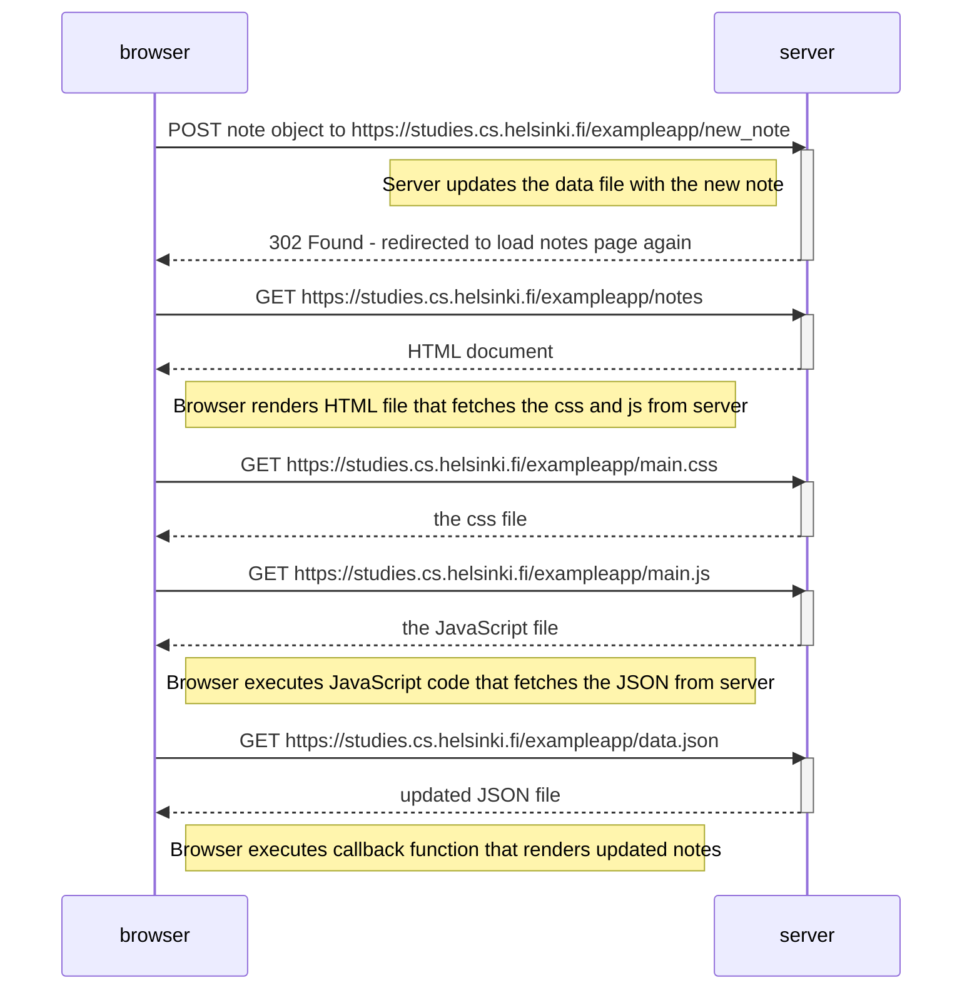

# 0.4 - New note diagram

Since the process is simply adding a new note and then reloading the page, the diagram is the same but with an extra round of communication in the beginning

```mermaid  
sequenceDiagram
    participant browser
    participant server

    browser->>server: POST note object to https://studies.cs.helsinki.fi/exampleapp/new_note
    activate server
    Note left of server: Server updates the data file with the new note
    server-->>browser: 302 Found - redirected to load notes page again
    deactivate server

    browser->>server: GET https://studies.cs.helsinki.fi/exampleapp/notes
    activate server
    server-->>browser: HTML document
    deactivate server

    Note right of browser: Browser renders HTML file that fetches the css and js from server

    browser->>server: GET https://studies.cs.helsinki.fi/exampleapp/main.css
    activate server
    server-->>browser: the css file
    deactivate server

    browser->>server: GET https://studies.cs.helsinki.fi/exampleapp/main.js
    activate server
    server-->>browser: the JavaScript file
    deactivate server

    Note right of browser: Browser executes JavaScript code that fetches the JSON from server

    browser->>server: GET https://studies.cs.helsinki.fi/exampleapp/data.json
    activate server
    server-->>browser: updated JSON file
    deactivate server

    Note right of browser: Browser executes callback function that renders updated notes
```
