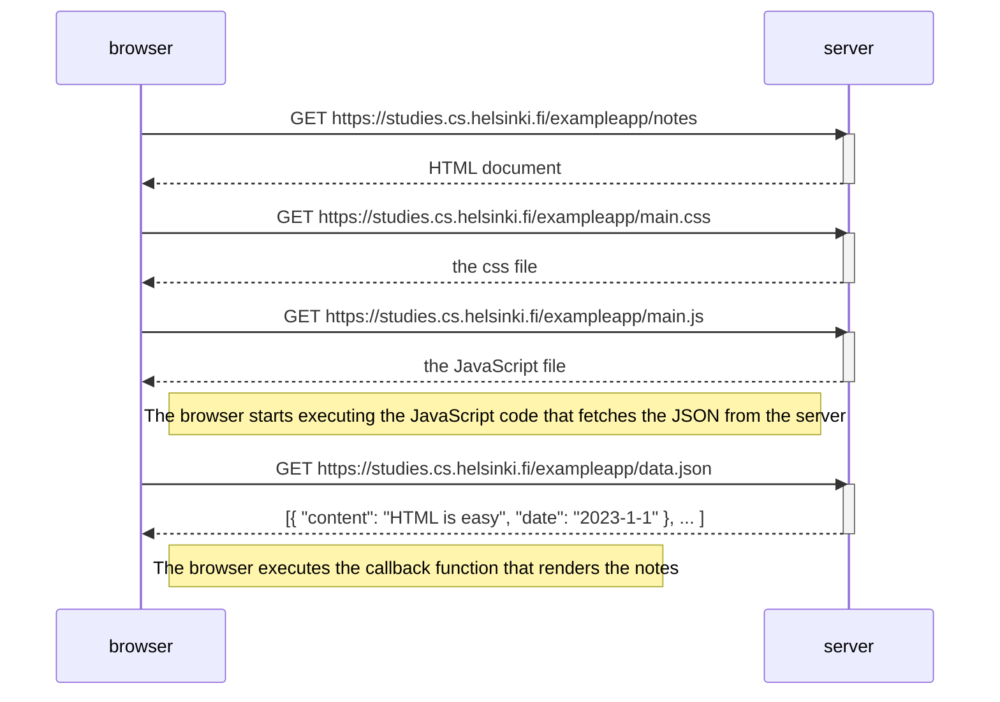

# 0.5 - Single page app diagram

The act of _entering_ the single page version of the notes app is no different than the traditional version:

- Browser requests HTML document via GET
- Server returns the document back to the browser
- Browser starts rendering the HTML, causing it to also request the CSS and JS files
- Server sends those to the browser
- Browser applies the CSS style and executes JS
- JS file requests the JSON file from server via AJAX and adds an event listener for when the file is received
- Server sends the JSON file to browser
- Browser triggers the event listener and executes the registered callback funtion
- Callback function renders the JSON data into a list on HTML document

* No need to bother looking at the diagram: it's exactly the same as the diagram in lesson [0.b.Loading a page containing JavaScript - review](https://studies.cs.helsinki.fi/exampleapp/data.json) which describes the process of entering the traditional notes app page :)

