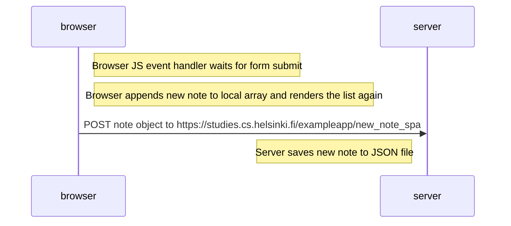

# 0.5 - New note in SPA diagram

```mermaid
sequenceDiagram

  participant browser
  participant server
  
  Note right of browser: Browser JS event handler waits for form submit
  Note right of browser: Browser appends new note to local array and renders the list again
  browser->>server: POST note object to https://studies.cs.helsinki.fi/exampleapp/new_note_spa
  activate server
  Note left of server: Server saves new note to JSON file

```
